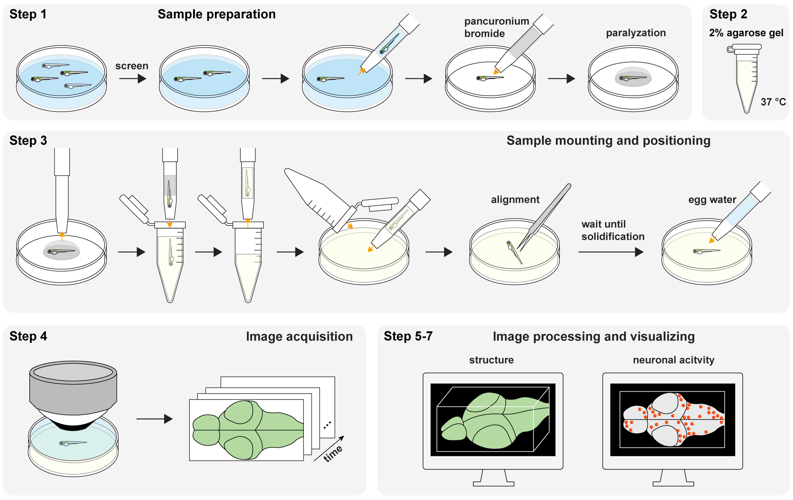

<h3 align="center">Imaging whole-brain of larval zebrafish in vivo using three-dimensional fluorescence microscopy</h3>

<p align="center">

</p>


## Abstract

As a vertebrate model animal, larval zebrafish are widely used in neuroscience and provide a unique opportunity to monitor the whole-brain activity at cellular resolution. Here we provide an optimized protocol for performing whole-brain imaging of larval zebrafish using three-dimensional fluorescence microscopy that includes sample preparation and immobilization, sample embedding, image acquisition, and visualization after imaging. Our protocol enables in vivo imaging of the structure and neuronal activity of a larval zebrafish brain at cellular resolution over an hour using confocal microscopy and custom-designed fluorescence microscopy. We discuss the critical steps in the protocol, including sample mounting and positioning, preventing bubble formation and dust in the agarose gel, and avoiding motion in images caused by incomplete solidification of the agarose gel and paralyzation of the fish. The protocol has been validated and confirmed in multiple settings. This protocol can be easily adapted for imaging other organs of a larval zebrafish. 


This repository is the source code we used for the visualization using napari in Protocol Step 5-7.

## System Requirements

### Hardware Requirements

```markdown
OS : Ubuntu 18.0.4
CPU : Intel i7-9700K
GPU : GeForce RTX 2080 Ti 11GB
RAM : 128GM
```

### Software Requirements

We tested on the following systems:

```markdown
- Ubuntu 18.04
- Python 3.9
- Pytorch 1.13.0
- CUDA 11.7
```

## Installation

It could depending on your network speed, but the installation generally took less than 20 minutes.

1. Clone the repository
```
git clone git@github.com:NICALab/Zebrafish-brain-visualization.git
```

2. Navigate into the cloned folder
```
cd ./Zebrafish-brain-visualization
```

3. Create the conda environment
```
conda env create -f env.yml
```

4. Activate the conda environment
```
conda activate Zebrafish-brain-visualization
```

5. Install Napari and Napari-animation plugin 
```
conda install -c conda-forge napari
conda install -c conda-forge napari-animation
```

6. Install Pytorch with **the version compatible with your OS and platform** from https://pytorch.org/get-started/locally/
```
conda install pytorch torchvision torchaudio pytorch-cuda=11.7 -c pytorch -c nvidia
```

## Getting Started
**1. Download demo data**

Demo data can be downloaded from [Google Drive Link](https://drive.google.com/drive/folders/1FsS3j9OhjLcKGmC3T7B8LkRuj2mXH8DW?usp=share_link)

**2. (Optional) Decompose background and activity from data using BEAR**
```
1) Run BEAR_v2_JoVE.m in the “BEAR_MATLAB_v2” folder.
```
```
2) Save the images of the background(L_img) and neuronal activity(S_img) as TIF files 
```

**3. Run demo notebook**
```
TODO
```


## Data availability
Demo data can be downloaded from [Google Drive Link](https://drive.google.com/drive/folders/1FsS3j9OhjLcKGmC3T7B8LkRuj2mXH8DW?usp=share_link )

## Contributors
We are happy to help with any questions or requests.
Please contact to following authors to get in touch!
* Seungjae Han (jay0118@kaist.ac.kr)
* Eun-Seo Cho (eunseo.cho@kaist.ac.kr)

## Citation
Cho, E.-S. et al. Imaging whole-brain of larval zebrafish in vivo using three-dimensional fluorescence microscopy. in revision (2023).
